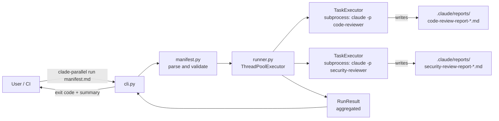
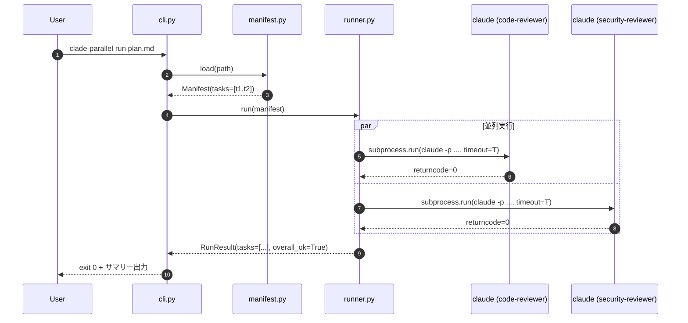

# アーキテクチャ設計レポート

## 設計日時
2026-04-20

## 設計対象
`clade-parallel` v0.1（Python 製 / Clade フレームワーク用の read-only 並列実行ラッパー）

スコープは MVP に限定する:

- YAML フロントマター付き Markdown マニフェストの読み込み
- read-only フラグが付いたタスクを並列実行する（v0.1 では read-only のみ対象）
- 各タスクの Claude Code CLI プロセスを子プロセスとして起動し、exit code で完了検知する
- 両方のレポートファイル（既存の命名規則に従って各エージェントが自身で出力）が `.claude/reports/` に生成される
- 実行結果（exit code / stdout / stderr / 経過時間 / タイムアウト有無）を集約して返す

v0.2 以降の機能（writes 宣言・worktree 隔離・`depends_on`・静的衝突チェック・リトライ・部分再開・テレメトリ）は本バージョンでは**実装しない**。ただしマニフェストのスキーマ設計とモジュール境界では、これら将来拡張の「逃げ道」として未知キーを許容する方針のみ明示する（後述）。

## 設計概要

主要な決定事項は以下のとおり。

| # | 決定事項 | 選択 | 根拠 |
|---|---|---|---|
| 1 | 並列実行方式 | `concurrent.futures.ThreadPoolExecutor` + `subprocess.run` | IO バウンド（外部プロセス待ち）に最適。標準ライブラリのみ。Windows/macOS/Linux で同一挙動 |
| 2 | エージェント起動方式 | `claude -p "<プロンプト>"` を subprocess で起動 | SDK 依存を増やさない。疎結合要件（Clade を import しない）を満たす |
| 3 | 完了検知 | `subprocess.run` の戻り値（`returncode`） | exit 0 = 成功、非 0 = 失敗。シンプル。stdout 解析やファイル監視より堅牢 |
| 4 | レポート出力の競合回避 | v0.1 は全エージェントを同じ作業ディレクトリで起動。ファイル名の `YYYYMMDD-HHmmss` タイムスタンプで衝突回避 | worktree 隔離は v0.3 に延期。MVP の複雑度を下げる |
| 5 | タイムアウト | タスクごと既定 900 秒（15 分）。マニフェストで上書き可 | 暴走プロセスで全体が固まるのを防ぐ |
| 6 | 失敗時の挙動 | 一方が失敗してももう一方は継続。全体の exit code は「いずれかが失敗したら 1」 | 「最小限の堅牢性」を満たす |
| 7 | マニフェストスキーマ | YAML フロントマター付き Markdown。`clade_plan_version` で互換性判定 | Clade の planner が出力する既存形式に合わせる。未知フィールドは無視する（前方互換） |
| 8 | 公開 API | CLI（`clade-parallel run <manifest>`）と Python 関数（`run_manifest(path)`）の両方 | CLI が一次 UX、Python 関数はテストと将来の組み込み用途 |

## アーキテクチャ図

### コンポーネント構成



### 実行シーケンス（v0.1 の主シナリオ）



## 設計の詳細

### コンポーネント構成

| モジュール | 責務 | 主要エクスポート |
|---|---|---|
| `clade_parallel/__init__.py` | パッケージエントリ。公開 API を再エクスポート | `run_manifest`, `Manifest`, `Task`, `RunResult`, `TaskResult`, `__version__` |
| `clade_parallel/manifest.py` | YAML フロントマター付き Markdown のパース・検証・データクラス定義 | `Manifest`, `Task`, `load_manifest`, `ManifestError`, `SUPPORTED_PLAN_VERSIONS` |
| `clade_parallel/runner.py` | 並列実行制御（ThreadPoolExecutor）・各タスクの subprocess 起動・結果集約 | `run_manifest`, `RunResult`, `TaskResult`, `RunnerError` |
| `clade_parallel/cli.py` | `argparse` ベースの CLI。`run` サブコマンドを提供。exit code を決定 | `main(argv)` |
| `clade_parallel/_exceptions.py`（任意・小さければ `manifest.py` 同居で可） | 例外クラスのベース | `CladeParallelError`（ベース）, `ManifestError`, `RunnerError` |

ディレクトリ構成（coding-conventions.md の `src/` レイアウトに準拠）:

```
clade-parallel/
├── pyproject.toml
├── src/
│   └── clade_parallel/
│       ├── __init__.py
│       ├── manifest.py
│       ├── runner.py
│       ├── cli.py
│       └── _exceptions.py        # 小さければ manifest.py に同居でも可
├── tests/
│   ├── __init__.py
│   ├── conftest.py
│   ├── test_manifest.py
│   ├── test_runner.py
│   └── test_cli.py
└── README.md
```

**依存方向（内側 → 外側）**:

```
cli.py  ─▶  runner.py  ─▶  manifest.py  ─▶  _exceptions.py
            │                │
            └───── (共に) ───┘
```

循環依存は禁止。`manifest.py` は `runner.py` を知らない。

### マニフェストのスキーマ設計

Clade の planner が生成する YAML フロントマター付き Markdown を契約とする。

#### フロントマター仕様（v0.1）

| キー | 型 | 必須 | 既定 | 説明 |
|---|---|---|---|---|
| `clade_plan_version` | string | 必須 | — | スキーマバージョン。v0.1 では `"0.1"` のみ受理。他の値は `ManifestError` |
| `name` | string | 任意 | `(マニフェストのファイル名)` | マニフェスト表示名。ログ・サマリーで使用 |
| `tasks` | list[Task] | 必須 | — | 実行対象タスクのリスト。空リストは `ManifestError` |
| （未知キー） | any | 任意 | — | **無視する**（前方互換のための逃げ道） |

`Task` の項目:

| キー | 型 | 必須 | 既定 | 説明 |
|---|---|---|---|---|
| `id` | string | 必須 | — | タスク識別子。マニフェスト内で一意。ログ・レポート照合に使う |
| `agent` | string | 必須 | — | 呼び出す Clade エージェント名（例: `code-reviewer`, `security-reviewer`）。CLI の `/agent-<agent>` コマンド名に変換される |
| `read_only` | bool | 必須 | — | `true` のみ実行対象。`false` のタスクが含まれる場合 v0.1 では `ManifestError`（スコープ外） |
| `prompt` | string | 任意 | `"/agent-<agent>"` | Claude CLI に渡すプロンプト。未指定時はエージェント名から自動生成 |
| `timeout_sec` | int | 任意 | `900` | タスク単位のタイムアウト秒数 |
| `cwd` | string | 任意 | マニフェスト所在ディレクトリ | 作業ディレクトリ。v0.1 では原則マニフェストのあるディレクトリ |
| `env` | dict[str, str] | 任意 | `{}` | サブプロセスに追加する環境変数 |
| （未知キー） | any | 任意 | — | **無視する**（`writes` / `depends_on` 等、v0.2 以降用の逃げ道） |

#### 最小サンプル

```markdown
---
clade_plan_version: "0.1"
name: "Review cycle 2026-04-20"
tasks:
  - id: code-review
    agent: code-reviewer
    read_only: true
  - id: security-review
    agent: security-reviewer
    read_only: true
    timeout_sec: 1200
---

# 実行計画（Markdown 本文）

この本文は `clade-parallel` では参照しない（人間向けのメモ）。
フロントマターのみが実行対象。
```

#### パース処理の方針

1. ファイルを UTF-8 で読み込み、先頭が `---\n` であることを確認（でなければ `ManifestError`）
2. 2 回目の `---\n` までをフロントマター、以降を本文として分離
3. フロントマターを `yaml.safe_load` で dict にパース（`PyYAML` 依存が許容できない場合は最小の自作パーサ。後述のトレードオフ参照）
4. `clade_plan_version` を `SUPPORTED_PLAN_VERSIONS = {"0.1"}` と比較
5. 必須キーの存在と型を検証 → `Manifest` / `Task` データクラスにマップ
6. `read_only` が `false` のタスクがあれば `ManifestError("v0.1 supports read-only tasks only")`
7. 未知キーは静かに無視する（前方互換）

### 公開 API

#### Python API（型アノテーションは `X | None` 形式・Python 3.10+）

```python
# clade_parallel/__init__.py
from clade_parallel.manifest import (
    Manifest,
    Task,
    ManifestError,
    load_manifest,
    SUPPORTED_PLAN_VERSIONS,
)
from clade_parallel.runner import (
    RunResult,
    TaskResult,
    RunnerError,
    run_manifest,
)

__version__ = "0.1.0"
```

```python
# clade_parallel/manifest.py
from dataclasses import dataclass, field
from pathlib import Path

SUPPORTED_PLAN_VERSIONS: frozenset[str] = frozenset({"0.1"})


class ManifestError(Exception):
    """Raised when the manifest file is malformed or unsupported."""


@dataclass(frozen=True)
class Task:
    id: str
    agent: str
    read_only: bool
    prompt: str
    timeout_sec: int
    cwd: Path
    env: dict[str, str] = field(default_factory=dict)


@dataclass(frozen=True)
class Manifest:
    path: Path
    clade_plan_version: str
    name: str
    tasks: tuple[Task, ...]


def load_manifest(path: str | Path) -> Manifest:
    """Parse and validate a YAML-frontmatter Markdown manifest."""
```

```python
# clade_parallel/runner.py
from dataclasses import dataclass
from clade_parallel.manifest import Manifest, Task


class RunnerError(Exception):
    """Raised for runner-level failures that prevent task execution."""


@dataclass(frozen=True)
class TaskResult:
    task_id: str
    agent: str
    returncode: int | None          # None when timed out without exit
    duration_sec: float
    timed_out: bool
    stdout: str
    stderr: str

    @property
    def ok(self) -> bool:
        return self.returncode == 0 and not self.timed_out


@dataclass(frozen=True)
class RunResult:
    manifest_name: str
    tasks: tuple[TaskResult, ...]

    @property
    def overall_ok(self) -> bool:
        return all(t.ok for t in self.tasks)


def run_manifest(
    manifest: Manifest | str | Path,
    *,
    max_workers: int | None = None,
    claude_executable: str = "claude",
) -> RunResult:
    """Run all read-only tasks in the manifest in parallel.

    Args:
        manifest: A loaded Manifest or a path to a manifest file.
        max_workers: Thread pool size. Defaults to len(manifest.tasks).
        claude_executable: Path/name of the Claude Code CLI binary.

    Returns:
        A RunResult summarizing every task's outcome.

    Raises:
        ManifestError: If the manifest fails to parse/validate.
        RunnerError: If the runner cannot start (e.g., executable missing).
    """
```

#### CLI

```
clade-parallel run <manifest_path> [--max-workers N] [--claude-exe PATH] [--quiet]
clade-parallel --version
clade-parallel --help
```

| オプション | 既定 | 説明 |
|---|---|---|
| `<manifest_path>` | 必須 | マニフェストファイルへのパス |
| `--max-workers` | タスク数 | スレッドプールサイズ |
| `--claude-exe` | `claude` | Claude CLI バイナリのパス |
| `--quiet` | false | 進捗ログを抑制（サマリーのみ出力） |

CLI の exit code:

| コード | 意味 |
|---|---|
| 0 | 全タスク成功 |
| 1 | 1 つ以上のタスクが失敗（非 0 exit / タイムアウト） |
| 2 | マニフェストパースエラー（`ManifestError`） |
| 3 | ランナー内部エラー（`RunnerError`。例: `claude` コマンドが存在しない） |

`pyproject.toml` の `[project.scripts]` に `clade-parallel = "clade_parallel.cli:main"` を登録する。

### データフロー

```
manifest.md (YAML frontmatter + Markdown)
        │ load_manifest()
        ▼
Manifest (frozen dataclass)
        │ run_manifest()
        ▼
ThreadPoolExecutor.submit() × N
        │
        ▼ 各スレッド:
subprocess.run(["claude", "-p", task.prompt], cwd=..., env=..., timeout=...)
        │
        ▼
CompletedProcess → TaskResult (returncode, stdout, stderr, duration, timed_out)
        │ 全件集約
        ▼
RunResult (tasks=tuple[TaskResult, ...], overall_ok)
        │ CLI が exit code に変換して終了
        ▼
exit 0 / 1 / 2 / 3
```

### エラーハンドリング方針

| 事象 | 検知 | 挙動 |
|---|---|---|
| マニフェストが存在しない | `load_manifest` の `FileNotFoundError` を `ManifestError` に変換 | CLI は exit 2 |
| フロントマターが壊れている / `clade_plan_version` が未サポート | `ManifestError` | CLI は exit 2 |
| `read_only: false` のタスクが含まれる | `ManifestError("v0.1 supports read-only tasks only")` | CLI は exit 2 |
| タスクのタイムアウト | `subprocess.TimeoutExpired` をキャッチ。プロセスを `kill()` | 当該タスクを `timed_out=True` で記録。**他のタスクは継続** |
| タスクが非 0 で終了 | `CompletedProcess.returncode != 0` | `TaskResult.ok=False` で記録。**他のタスクは継続** |
| `claude` コマンドが存在しない | 全タスクで `FileNotFoundError` | `RunnerError` として最初の 1 件で早期失敗（CLI は exit 3） |
| 予期しない例外（スレッド内） | `Future.exception()` 経由で捕捉 | `TaskResult.stderr` にトレースバックを格納、`returncode=None, timed_out=False, ok=False`。他のタスクは継続 |

**「最小限の堅牢性」方針**: 「各タスクに必ずタイムアウト」「1 タスクの失敗が他を止めない」「全体の成否は集約後に判定」の 3 点のみ担保し、リトライや部分再開は v0.2 以降に委ねる。

### 並列実行の実装詳細

```python
# runner.py 抜粋（イメージ）
from concurrent.futures import ThreadPoolExecutor
import subprocess
import time


def _execute(task: Task, claude_exe: str) -> TaskResult:
    cmd = [claude_exe, "-p", task.prompt]
    env = {**os.environ, **task.env}
    start = time.monotonic()
    try:
        completed = subprocess.run(
            cmd,
            cwd=task.cwd,
            env=env,
            capture_output=True,
            text=True,
            timeout=task.timeout_sec,
            check=False,
        )
    except subprocess.TimeoutExpired as exc:
        return TaskResult(
            task_id=task.id,
            agent=task.agent,
            returncode=None,
            duration_sec=time.monotonic() - start,
            timed_out=True,
            stdout=(exc.stdout or b"").decode("utf-8", errors="replace")
            if isinstance(exc.stdout, bytes) else (exc.stdout or ""),
            stderr=(exc.stderr or b"").decode("utf-8", errors="replace")
            if isinstance(exc.stderr, bytes) else (exc.stderr or ""),
        )
    return TaskResult(
        task_id=task.id,
        agent=task.agent,
        returncode=completed.returncode,
        duration_sec=time.monotonic() - start,
        timed_out=False,
        stdout=completed.stdout,
        stderr=completed.stderr,
    )


def run_manifest(manifest, *, max_workers=None, claude_executable="claude") -> RunResult:
    if isinstance(manifest, (str, Path)):
        manifest = load_manifest(manifest)
    pool_size = max_workers or max(1, len(manifest.tasks))
    with ThreadPoolExecutor(max_workers=pool_size) as pool:
        futures = [pool.submit(_execute, t, claude_executable) for t in manifest.tasks]
        results = tuple(f.result() for f in futures)
    return RunResult(manifest_name=manifest.name, tasks=results)
```

**Why スレッドで十分か**: 各タスクは外部プロセス待ち（IO バウンド）であり GIL の影響を受けない。`subprocess.run` はスレッドセーフ。プロセスプールと違いフォーク問題も無い。

### v0.1 スコープ外（将来拡張）の扱い

実装しないが、**データモデルと境界だけは将来導入しやすい形にする**:

| 将来機能 | v0.1 での「逃げ道」 | 導入タイミング |
|---|---|---|
| `writes` 宣言 + 静的衝突チェック | マニフェストパーサは未知キーを無視する → v0.2 で `writes: [glob, ...]` を追加してもエラーにしない。`Manifest` に `writes` 相当フィールドを増やすだけ | v0.2 |
| `depends_on` | 同上。ランナーは「全タスク並列」前提で書くが、DAG スケジューラは別モジュール `scheduler.py` として追加する想定 | v0.2 |
| worktree 隔離 | タスクごとに `cwd` を差し替えられる構造（既に `Task.cwd` を持つ）。v0.1 はマニフェスト所在ディレクトリで固定 | v0.3 |
| スキーマバージョンゲート | `SUPPORTED_PLAN_VERSIONS` を frozenset として外出ししてある。v0.2 で `{"0.1", "0.2"}` に拡張するだけ | v0.2 以降継続 |
| リトライ / 部分再開 | `TaskResult` に `returncode`, `stderr`, `duration_sec` を保持している → 失敗タスク特定は可能。再実行は「失敗タスクのみのマニフェストを生成する」別ツールに任せる方向 | 将来 |
| テレメトリ | `TaskResult.duration_sec` を既に保持。将来 JSON 出力オプション（例: `--json`）を CLI に追加する余地を残す | 将来 |

**明確に実装しないこと**:

- writes / depends_on の解釈
- worktree 作成・マージ
- リトライ
- 非 read-only タスクの実行

これらはマニフェストに現れた場合も v0.1 は**エラーで拒否**（`read_only: false`）または**無視**（未知キー `writes` 等）する。

### テスト戦略

pytest で以下の観点を押さえる。カバレッジ目標は 80% 以上（MVP 水準）。

#### `tests/test_manifest.py`

| テスト観点 | 代表ケース | モック |
|---|---|---|
| 正常パース | 最小マニフェストが `Manifest` に変換される | なし（tmp_path にファイル作成） |
| `clade_plan_version` 未サポート | `"0.9"` → `ManifestError` | なし |
| 必須フィールド欠落 | `agent` 欠落 → `ManifestError` | なし |
| 型エラー | `read_only: "yes"` → `ManifestError` | なし |
| read-only 以外を拒否 | `read_only: false` を含む → `ManifestError` | なし |
| 未知キー許容 | `writes: [...]` があっても成功する（無視） | なし |
| タイムアウト既定値 | `timeout_sec` 未指定時に 900 になる | なし |
| `cwd` 既定値 | マニフェストと同じディレクトリになる | なし |
| ファイル不在 | 存在しないパスで `ManifestError` | なし |
| フロントマター欠落 | `---` が無い → `ManifestError` | なし |
| `@pytest.mark.parametrize` で境界値を網羅 | `clade_plan_version` の `""` / 数値型 / 未知文字列 | なし |

#### `tests/test_runner.py`

| テスト観点 | 代表ケース | モック対象 |
|---|---|---|
| 並列実行が両タスクを呼ぶ | 2 タスクが両方実行される | `subprocess.run` を monkeypatch で差し替え、呼び出し引数を記録 |
| exit 0 で `ok=True` | `CompletedProcess(returncode=0)` を返すスタブ | 同上 |
| exit 1 で `ok=False` かつ他タスク継続 | タスク A が exit 1、B が exit 0 → `overall_ok=False`、B は成功 | 同上 |
| タイムアウトで `timed_out=True` | `TimeoutExpired` を投げるスタブ | 同上 |
| 例外時に他タスク継続 | タスク A で例外、B は成功 | 同上 |
| `claude` 実行ファイル未検出 | `FileNotFoundError` → `RunnerError` | 同上 |
| 空タスクリスト | パース段階で弾かれるため、ここでは扱わない | — |
| `cwd` / `env` が subprocess に正しく渡る | 呼び出し引数のアサーション | 同上 |
| 実プロセスを使う smoke テスト（任意） | `python -c "import sys; sys.exit(0)"` を `claude_executable` として指定 | なし（`@pytest.mark.slow`） |

**モックの方針**: `monkeypatch.setattr("clade_parallel.runner.subprocess.run", fake_run)` で差し替える。`fake_run` はタスクごとに挙動を切り替えられるディスパッチャ。並列性自体は「両方の `fake_run` が呼ばれたこと」と「総実行時間がタスクごとの `sleep` 合計より短いこと」で検証する。

#### `tests/test_cli.py`

| テスト観点 | 代表ケース | モック対象 |
|---|---|---|
| `run` サブコマンドで正常終了 | exit code 0 | `run_manifest` を差し替えて全成功を返す |
| 失敗時 exit 1 | タスクに失敗を混ぜる | 同上 |
| マニフェストエラー exit 2 | `load_manifest` が `ManifestError` | 同上 |
| ランナーエラー exit 3 | `run_manifest` が `RunnerError` | 同上 |
| `--version` | `__version__` を出力して exit 0 | なし |
| `--quiet` | 進捗ログが抑制される | capsys |

#### `conftest.py` に置く共通フィクスチャ

- `manifest_file(tmp_path, content)`: 指定内容で `.md` を書き出しパスを返す
- `fake_claude_runner(monkeypatch, outcomes)`: タスク ID ごとに `returncode`/タイムアウト/例外を指定できる `subprocess.run` スタブ

## トレードオフ

| 選択肢 | メリット | デメリット | 採用 |
|---|---|---|---|
| **並列方式** | | | |
| ThreadPoolExecutor + subprocess.run | 標準ライブラリのみ・IO バウンド向き・実装が直感的・Windows/mac/Linux 同一 | CPU バウンド処理には不向き（本件では無関係） | ○（採用） |
| ProcessPoolExecutor | GIL 回避 | フォーク問題（Windows は spawn）・オーバーヘッド・pickling 制約 | ✗ |
| asyncio + create_subprocess_exec | async スタイル・高並列 | 呼び出し側を async にする必要・複雑度増 | ✗ |
| **エージェント起動方式** | | | |
| `claude -p` サブプロセス | SDK 不要・疎結合要件を満たす・標準機能 | stdout 解析での詳細な進捗取得は困難（exit code のみ信頼） | ○（採用） |
| Claude Code SDK / ライブラリ呼び出し | API が豊富 | 依存が増える・疎結合要件に反する可能性 | ✗ |
| **完了検知** | | | |
| exit code | シンプル・信頼できる | 「レポートが書けたか」までは分からない（エージェント側の責務） | ○（採用） |
| レポートファイルの存在確認 | 実成果物を確認できる | タイムスタンプ予測不能・polling 実装必要・race に弱い | ✗ |
| stdout 解析 | 進捗取得可能 | パーサ仕様が Clade と結合する・脆い | ✗ |
| **レポート競合回避** | | | |
| 同じ cwd + タイムスタンプ命名 | 実装ゼロ・既存運用の延長 | 秒未満で 2 つのタスクが発火すると衝突リスク（実際はエージェント差でまず起きない） | ○（v0.1 採用） |
| worktree 隔離 + 後段マージ | 完全な分離 | 実装コストが大きい・MVP に不要 | ✗（v0.3 以降） |
| プロセスごと個別 cwd | 中間案 | `.claude/reports/` の位置がバラバラになりユーザー体験が悪化 | ✗ |
| **YAML パーサ** | | | |
| `PyYAML` | デファクト・安全な `safe_load` がある | サードパーティ依存（だが実質業界標準） | ○（採用候補） |
| 自作最小パーサ | 依存ゼロ | バグ温床・YAML 仕様の再発明・保守負債 | ✗ |
| `tomllib`（TOML に切り替え） | 標準ライブラリ | Clade の planner が生成するのは YAML frontmatter。契約に反する | ✗ |

> 補足: 要件に「サードパーティ依存を最小限」とあるが、YAML フロントマターを契約とする以上、実質的に `PyYAML` 1 つだけを許容するのが最も健全。`pyproject.toml` でピン留めし、`install_requires = ["PyYAML>=6.0"]` とする。

## planner への引き継ぎ事項

### 実装順序の推奨

TDD サイクルを前提に、以下の順で進めるのが最短:

1. **`manifest.py` + `test_manifest.py`** を最初に完成させる
   - 外部依存がなく純粋関数としてテストしやすい
   - `PyYAML` の導入もここで確定する
2. **`runner.py` + `test_runner.py`** を次に実装
   - `subprocess.run` を monkeypatch で差し替えたテストを主軸にする
   - 実プロセスを使う smoke テスト 1 本を `@pytest.mark.slow` で保持
3. **`cli.py` + `test_cli.py`** を最後に実装
   - `argparse` + `run_manifest` の薄いラッパー
   - exit code マッピングのテストを網羅
4. **E2E 動作確認**（手動）
   - ローカルで `clade-parallel run examples/manifest.md` を実行し、実際に `code-review-report-*.md` と `security-review-report-*.md` が `.claude/reports/` に生成されることを確認

### 依存関係・制約

- **Python 3.10+**（型注釈で `X | None` 構文を使用）
- **PyYAML 6.0+**（唯一のランタイム依存）
- **dev 依存**: `pytest>=7`, `ruff`, `black`, `mypy`（`pyproject.toml` の `[project.optional-dependencies].dev` に記載）
- **Clade 側を import しない**（疎結合契約の厳守。CLI を subprocess で呼ぶのみ）
- **`.claude/reports/` ディレクトリの作成は Clade エージェント側の責務**（本ツールは作らない）
- `pyproject.toml` の `[project.scripts]` に `clade-parallel = "clade_parallel.cli:main"` を登録

### 実装時の注意点

- `subprocess.run` の `text=True` を必ず指定（stdout/stderr を文字列として受け取る）。ただし `TimeoutExpired` 時の stdout/stderr は `bytes` で返る実装バージョンもあるため、両対応のデコード処理を入れる（上記コード例を参照）
- `env` を渡す際は `os.environ` のコピーをベースに `task.env` を上書きマージする（`PATH` を消さないため）
- `ThreadPoolExecutor` は `with` 文で使い、ブロックを抜けるときに自動で join されるようにする
- Windows で `subprocess.run` の `timeout` が発火しても子プロセスが残る場合がある → `TimeoutExpired` ブロック内で `process.kill()` 相当の後始末を明示的に書く（直接 `Popen` に切り替える手もあるが MVP では `run` のままで十分。挙動がおかしければ `Popen` への移行を検討）
- `frozen=True` dataclass は変更不可のため、テストでビルダー関数を用意するとラク

### 受け入れ基準（v0.1 の DoD 再掲）

- [ ] 最小サンプルマニフェスト（`code-reviewer` + `security-reviewer`）が並列実行できる
- [ ] 両レポートが `.claude/reports/` に生成される
- [ ] どちらか片方が失敗してももう片方は完走する
- [ ] 全タスク成功時は exit 0、いずれか失敗時は exit 1、マニフェストエラーは exit 2、ランナーエラーは exit 3
- [ ] pytest が Windows / macOS / Linux（または最低 1 OS + CI）で全て green
- [ ] ruff / black 準拠・mypy エラーなし

## ADR 作成の推奨

以下の決定は将来のメンテナが「なぜこの設計なのか」を辿れるよう ADR 化を推奨する:

| ADR 候補 | 推奨タイトル | 理由 |
|---|---|---|
| ADR-001 | Adopt ThreadPoolExecutor + subprocess for parallel execution | 後続で asyncio / ProcessPoolExecutor への切り替え提案が出た際の判断根拠になる |
| ADR-002 | Use `claude -p` subprocess instead of Claude Code SDK | 疎結合要件と「Clade を import しない」という契約の記録 |
| ADR-003 | Defer worktree isolation to v0.3; rely on timestamped filenames in v0.1 | MVP 判断のトレードオフ記録。後日 worktree を入れる PR の参照点になる |
| ADR-004 | Adopt PyYAML as the single third-party runtime dependency | 「標準ライブラリ優先」の方針に例外を設けた理由を残す |
| ADR-005 | Version gate via `clade_plan_version` using `SUPPORTED_PLAN_VERSIONS` frozenset | v0.2 以降の拡張ポイント（gate を緩めるだけ）の設計意図を明文化 |

保存場所は `docs/adr/ADR-00X-<kebab-title>.md`。planner が実装タスクと並行して作成タスクを立てること。
